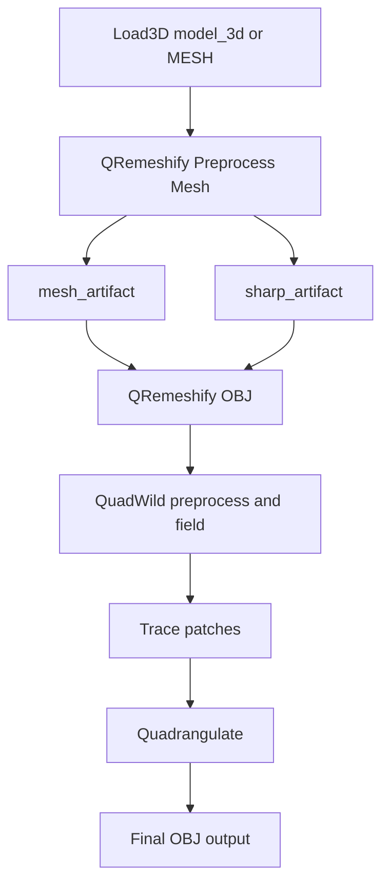

# ComfyUI-QRemeshify

ComfyUI custom nodes for running the QRemeshify remeshing pipeline from Python, using the bundled `qremesh_backend` DLLs.

This project is based on [QRemeshify](https://github.com/ksami/QRemeshify), which is itself based on [QuadWild with Bi-MDF solver](https://github.com/cgg-bern/quadwild-bimdf) and [QuadWild](https://github.com/nicopietroni/quadwild).

# What It Does
- Runs the native `quadwild` backend from ComfyUI
- Produces quad-oriented remeshed OBJ output
- Exposes a dedicated preprocessing node for normalization, symmetry, optional decimation, and sharp-feature generation
- Supports `BPY`, `LIBIGL`, and `TRIMESH` backends for mesh preprocessing
- Uses extension-owned runtime config files under `qremeshify_config` for advanced solver settings

Currently registered extension nodes:
- `QRemeshify Mesh To OBJ`
- `QRemeshify Preprocess Mesh`
- `QRemeshify OBJ`

# Included Nodes
## `QRemeshify Preprocess Mesh`
Normalizes a mesh into a triangle OBJ and can optionally:
- apply symmetry preprocessing
- decimate the mesh
- generate a QRemeshify-compatible `.sharp` file

Inputs:
- `input_mesh`: uploaded/selected `FILE_3D` or `MESH`
- `backend`: `AUTO`, `BPY`, `LIBIGL`, or `TRIMESH`
- `symmetry_x`, `symmetry_y`, `symmetry_z`
- `decimate_enabled`
- `decimate_target_faces`
- `decimate_ratio`
- `allow_backend_fallback`
- `generate_sharp`
- `sharp_angle`
- `sharp_backend`: `AUTO`, `BPY`, `LIBIGL`, or `TRIMESH`
- `output_dir` optional
- `output_prefix` optional

Outputs:
- `output_obj`
- `workspace_dir`
- `model_3d`
- `mesh_artifact`
- `sharp_features_path`
- `sharp_artifact`

## `QRemeshify Mesh To OBJ`
Utility/debug node that converts a mesh input into an OBJ file for downstream nodes.

Inputs:
- `input_mesh`: uploaded/selected `FILE_3D` or `MESH`
- `backend`: `AUTO`, `BPY`, `LIBIGL`, or `TRIMESH`
- `allow_backend_fallback`
- `output_dir` optional
- `output_prefix` optional

Outputs:
- `output_obj`
- `workspace_dir`
- `mesh_artifact`

## `QRemeshify OBJ`
Runs the actual QRemeshify backend on an OBJ file.

Inputs:
- `input_obj`: uploaded/selected `.obj` input for remeshing
- `smooth`
- `sharp_angle`
- `scale_factor`
- `fixed_chart_clusters`
- `alpha`
- `ilp_method`: `LEASTSQUARES` or `ABS`
- `time_limit`
- `gap_limit`
- `minimum_gap`
- `isometry`
- `regularity_quadrilaterals`
- `regularity_non_quadrilaterals`
- `regularity_non_quadrilaterals_weight`
- `align_singularities`
- `align_singularities_weight`
- `repeat_losing_constraints_iterations`
- `repeat_losing_constraints_quads`
- `repeat_losing_constraints_non_quads`
- `repeat_losing_constraints_align`
- `hard_parity_constraint`
- `flow_config`: `SIMPLE` or `HALF`
- `satsuma_config`: `DEFAULT`, `MST`, `ROUND2EVEN`, `SYMMDC`, `EDGETHRU`, `LEMON`, or `NODETHRU`
- `sharp_features_path` optional
- `mesh_artifact` optional
- `sharp_artifact` optional
- `use_cache`: reuse previously generated traced intermediates and rerun only quadrangulation
- `callback_time_limit`: eight comma-separated callback thresholds
- `callback_gap_limit`: eight comma-separated callback thresholds
- `output_dir` optional

Outputs:
- `output_obj`
- `workspace_dir`
- `model_3d`
- `remeshed_obj`
- `traced_obj`
- `output_mesh_artifact`
- `remeshed_mesh_artifact`
- `traced_mesh_artifact`

# Recommended Workflow
Preferred workflow:

1. `Load3D.model_3d` or another mesh source
2. `QRemeshify Preprocess Mesh`
3. `QRemeshify OBJ`

Wire them like this:
- `mesh_artifact` -> `mesh_artifact`
- `sharp_artifact` -> `sharp_artifact`

This is the preferred workflow because the preprocess node writes the normalized triangle OBJ internally, and the `.sharp` file indices must match the exact OBJ consumed by the backend.

Optional utility workflow:

1. `QRemeshify Mesh To OBJ`
2. inspect/export the OBJ or feed it into other tooling

# Backend Isolation And Fallback
Explicit backend selection is isolated by default:
- `backend="BPY"` keeps preprocessing on the Blender path
- `backend="LIBIGL"` keeps preprocessing on the libigl path
- `backend="TRIMESH"` keeps preprocessing on the trimesh path
- `backend="AUTO"` is the only mode that freely selects across backends by default

`allow_backend_fallback` changes that behavior for explicit backend selections.

When `allow_backend_fallback=false`:
- the selected backend boundary is enforced
- unsupported operations fail with a clear error instead of silently switching backends

When `allow_backend_fallback=true`:
- the node may cross backend boundaries when the selected backend is unavailable or cannot satisfy the requested preprocessing operation
- example: `backend="LIBIGL"` with non-manifold decimation input can fall back to `BPY` if Blender is available
- example: `backend="BPY"` can fall back away from Blender if `bpy` is unavailable and the requested operation does not require Blender-only functionality

Backend-specific notes:
- `BPY` is required for symmetry preprocessing
- `LIBIGL` supports normalization and decimation
- `TRIMESH` supports normalization, sharp-feature generation, and decimation, but does not provide symmetry
- `sharp_backend` follows the same rule set:
  - explicit `BPY` stays on Blender for sharp-feature generation
  - explicit `LIBIGL` stays on libigl and uses `igl.sharp_edges(...)`
  - explicit `TRIMESH` stays on trimesh
  - `AUTO` selects the best available backend
  - `LIBIGL` sharp generation additionally depends on the installed libigl build exposing `igl.sharp_edges`

Concrete `backend="AUTO"` behavior in preprocessing:
- if symmetry is requested and `bpy` is available, `AUTO` resolves to `BPY`
- else if decimation is requested and `bpy` is available, `AUTO` resolves to `BPY`
- else if decimation is requested and `libigl` is available, `AUTO` resolves to `LIBIGL`
- else if decimation is requested, `AUTO` resolves to `TRIMESH`
- otherwise `AUTO` resolves to `BPY` when available, else `TRIMESH`

Concrete `sharp_backend="AUTO"` behavior:
- `BPY` when `bpy` is available
- else `LIBIGL` when the installed libigl build exposes `igl.sharp_edges`
- else `TRIMESH`

# Manifold Requirements
`LIBIGL` decimation uses `igl.decimate(...)`. Per the libigl Python binding docs, it assumes a manifold mesh, possibly with boundary.

This extension checks manifoldness before `LIBIGL` decimation using:
- `igl.is_edge_manifold(F)`
- `igl.is_vertex_manifold(F)`

Behavior:
- if both checks pass, `LIBIGL` decimation proceeds
- if either check fails and `allow_backend_fallback=false`, preprocessing raises a clear error
- if either check fails and `allow_backend_fallback=true`, preprocessing may fall back to `BPY` if available

Practical implication:
- non-manifold meshes are not valid inputs for the strict `LIBIGL` decimation path
- open meshes can still be acceptable as long as they remain manifold with boundary

Reference docs:
- https://libigl.github.io/libigl-python-bindings/igl_docs/
- https://github.com/libigl/libigl-python-bindings/blob/main/tutorial/igl_docs.md

# Data Contract
The nodes support two contracts in parallel:

- compatibility contract: plain `STRING` file paths
- richer contract: in-memory ComfyUI artifacts

Artifact types:
- `QREMESHIFY_MESH`
- `QREMESHIFY_SHARP`

Current behavior:
- `QRemeshify Mesh To OBJ` returns both `output_obj` and `mesh_artifact`
- `QRemeshify Preprocess Mesh` returns both path outputs and artifact outputs
- `QRemeshify OBJ` accepts legacy string inputs and can also consume `mesh_artifact` and `sharp_artifact`
- preprocessing artifacts can include in-memory payloads:
  - mesh artifacts: `vertices`, `faces`
  - sharp artifacts: parsed feature rows
- `QRemeshify OBJ` prefers in-memory payloads when present and materializes OBJ / `.sharp` files only immediately before the native backend boundary
- returned remesh-stage mesh artifacts also include parsed `vertices` / `faces` payloads from backend OBJ outputs

The internal pipeline still operates on filesystem-backed OBJ and `.sharp` files, but nodes no longer have to communicate only through bare path strings.

# Cache Behavior
- `use_cache=true` skips the `QRemeshify OBJ` remesh-and-trace stages and reruns only quadrangulation
- it reuses the existing `_rem_p0.obj` traced mesh from the same `output_dir`
- this requires a prior run with `use_cache=false` in that same `output_dir`
- `use_cache=true` requires `output_dir` to be set explicitly

# Requirements
- Windows
- ComfyUI
- Python environment used by ComfyUI
- Bundled backend DLLs in `qremesh_backend`

Python packages:
- `bpy` optional but preferred for Blender-faithful preprocessing
- `libigl`
- `trimesh`
- `fast-simplification` optional, required for `TRIMESH` decimation
- `numpy`

Runtime assets bundled with this extension:
- `qremesh_backend` for the native DLLs
- `qremeshify_config` for solver configuration files

Install the Python dependencies into ComfyUI's environment:

```powershell
# either from ComfyUI terminal or with ComfyUI python venv activated
pip install -r requirements.txt
```

# Installation
1. Place this repository under `ComfyUI/custom_nodes/`
   ```bash
   cd $HOME/ComfyUI/custom_nodes # or your ComfyUI installation directory
   git clone https://github.com/akashskypatel/ComfyUI-QRemeshify.git
   ```
2. Install Python dependencies in the ComfyUI venv:

```powershell
pip install -r requirements.txt
```

3. Restart ComfyUI

# Mesh Format Support
The native backend consumes OBJ files.

Current practical support:
- `QRemeshify Preprocess Mesh`: accepts `FILE_3D` or `MESH` through the node UI, then converts to OBJ through the selected preprocessing backend
- `QRemeshify Mesh To OBJ`: accepts `FILE_3D` or `MESH` through the node UI, then converts to OBJ through the selected backend
- `QRemeshify OBJ`: uploaded/selected `.obj` through the node UI, or a resolved OBJ path via `mesh_artifact`

Common pattern:
- load `GLB`, `GLTF`, `STL`, `PLY`, `OBJ`, or another supported format in `Load3D` or another upstream node
- pass `model_3d` or `MESH` into `QRemeshify Preprocess Mesh`
- pass the returned artifacts into `QRemeshify OBJ`

# Current Limitations
- Symmetry preprocessing is implemented only on `BPY` backend
- `LIBIGL` decimation requires a manifold triangle mesh
- `TRIMESH` decimation depends on trimesh's quadric-decimation support being installed and working in the active Python environment, which typically requires `fast-simplification`
- `.rosy` and the native tracing/quadrangulation stages remain file-backed internally
- All dependencies must be installed under ComfyUI's python environment.

# Tips
- Keep meshes reasonably sized; remeshing cost grows quickly with mesh complexity
- Starting from triangulated geometry usually gives more predictable results
- If you need strict backend isolation, keep `allow_backend_fallback=false`
- If you need a more forgiving preprocess path, enable `allow_backend_fallback`
- If you want reliable sharp preservation, use `QRemeshify Preprocess Mesh` to generate `sharp_artifact` from the exact normalized OBJ that will feed remeshing
- Preserve the generated `workspace_dir` when debugging intermediate outputs

# Pipeline

