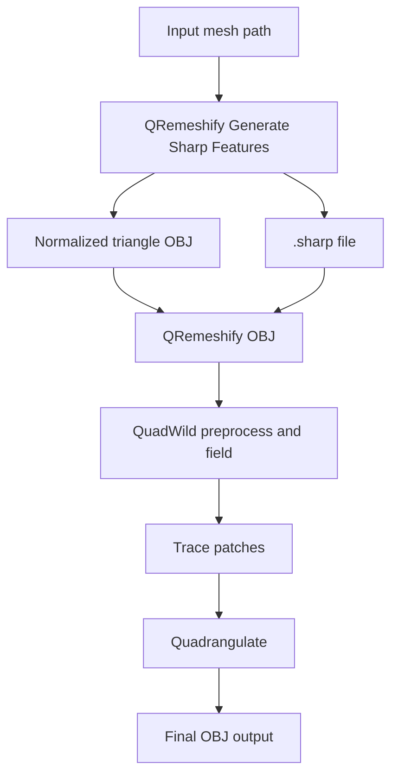

# ComfyUI-QRemeshify

ComfyUI custom nodes for running the QRemeshify remeshing pipeline from Python, using the bundled `qremesh_backend` DLLs.

This project is based on [QRemeshify](https://github.com/ksami/QRemeshify), which is itself based on [QuadWild with Bi-MDF solver](https://github.com/cgg-bern/quadwild-bimdf) and [QuadWild](https://github.com/nicopietroni/quadwild).

# What It Does
- Runs the native QRemeshify backend from ComfyUI
- Produces quad-oriented remeshed OBJ output
- Exposes a dedicated sharp-feature generation node
- Supports `LIBIGL` and `TRIMESH` backends for generating `.sharp` files
- Reuses the original QRemeshify config files for advanced solver settings

# Included Nodes
## `QRemeshify Mesh To OBJ`
Converts a mesh path into an OBJ file for downstream QRemeshify nodes.

Behavior:
- if the input is already `.obj`, it is copied into the node workspace
- otherwise the mesh is loaded through `trimesh` and written as a triangle OBJ

Inputs:
- `input_mesh`: path to the source mesh
- `output_dir` optional
- `output_prefix` optional

Outputs:
- `output_obj`
- `workspace_dir`

## `QRemeshify Generate Sharp Features`
Preprocesses a mesh into:
- a normalized triangle OBJ
- a QRemeshify-compatible `.sharp` file
- a workspace directory path

Inputs:
- `input_mesh`: path to the source mesh
- `backend`: `LIBIGL` or `TRIMESH`
- `sharp_angle`: dihedral angle threshold in degrees
- `output_dir` optional
- `output_prefix` optional

Outputs:
- `mesh_obj`
- `sharp_features_path`
- `workspace_dir`

## `QRemeshify OBJ`
Runs the actual QRemeshify backend on an OBJ file.

Inputs:
- `input_obj`: path to the OBJ to remesh
- `preprocess`
- `smooth`
- `detect_sharp`
- `sharp_angle`
- `sharp_features_path` optional
- `sharp_backend` optional fallback if `detect_sharp=True` and no `.sharp` file is supplied
- advanced solver controls such as `alpha`, `ilp_method`, `flow_config`, and `satsuma_config`

Outputs:
- `output_obj`
- `workspace_dir`
- `remeshed_obj`
- `traced_obj`

# Recommended ComfyUI Workflow
Use either of these preprocessing paths:

1. `QRemeshify Mesh To OBJ` -> `QRemeshify OBJ`
2. `QRemeshify Generate Sharp Features` -> `QRemeshify OBJ`

For the sharp-feature workflow, wire them like this:
- `mesh_obj` -> `input_obj`
- `sharp_features_path` -> `sharp_features_path`

This is the preferred workflow because the sharp-feature node writes a normalized triangle OBJ, and the `.sharp` file indices must match the exact OBJ consumed by the backend.

If you skip the first node, `QRemeshify OBJ` can still auto-generate sharp features when:
- `detect_sharp=True`
- `sharp_features_path` is empty

# Requirements
- Windows
- ComfyUI
- Python environment used by ComfyUI
- Bundled backend DLLs in `qremesh_backend`

Python packages:
- `libigl`
- `trimesh`
- `numpy`

Install the Python dependencies into ComfyUI's environment:

```powershell
pip install -r requirements.txt
```

# Installation
1. Place this repository under `ComfyUI/custom_nodes/`
2. Install Python dependencies in the ComfyUI venv:

```powershell
pip install -r requirements.txt
```

3. Restart ComfyUI

# Mesh Format Support
The native backend currently consumes OBJ files.

Current practical support is:
- `QRemeshify Mesh To OBJ`: converts common mesh formats readable by `trimesh` into OBJ
- `QRemeshify OBJ`: OBJ input only
- `QRemeshify Generate Sharp Features`: any mesh format that your installed backend loader can read through `trimesh`, then converted to normalized triangle OBJ output

That means a common pattern is:
- load `STL`, `PLY`, or another supported format in `QRemeshify Mesh To OBJ` or `QRemeshify Generate Sharp Features`
- pass the generated `mesh_obj` to `QRemeshify OBJ`

# Current Limitations
- Symmetry is not implemented yet in the ComfyUI node path
- The final backend output is currently returned as OBJ path strings, not a native in-memory mesh datatype for ComfyUI
- `QRemeshify OBJ` expects filesystem paths, not uploaded binary mesh tensors or geometry objects
- Sharp-feature generation depends on `libigl` or `trimesh` being available in the same Python environment ComfyUI is using
- Convexity inference in the generated `.sharp` file may need refinement for meshes with inconsistent winding

# Tips
- Keep meshes reasonably sized; remeshing cost grows quickly with mesh complexity
- Starting from triangulated geometry usually gives more predictable results
- If you want sharp guidance, prefer the dedicated sharp-feature node over remesh-node auto-generation
- Preserve the generated `workspace_dir` when debugging intermediate outputs

# Pipeline

